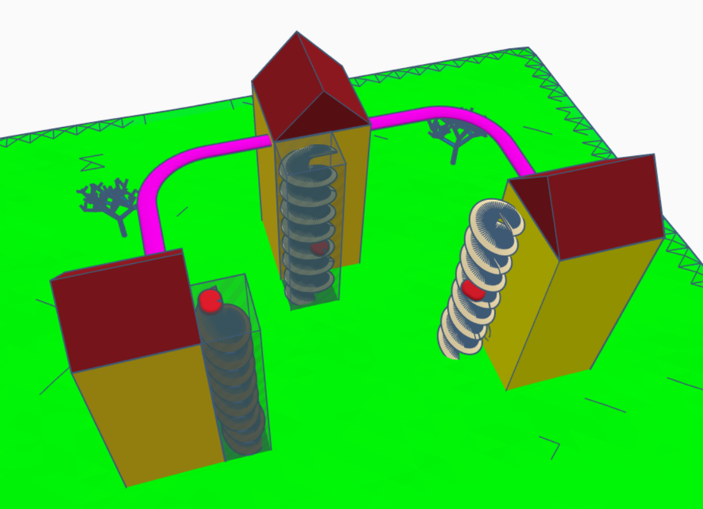
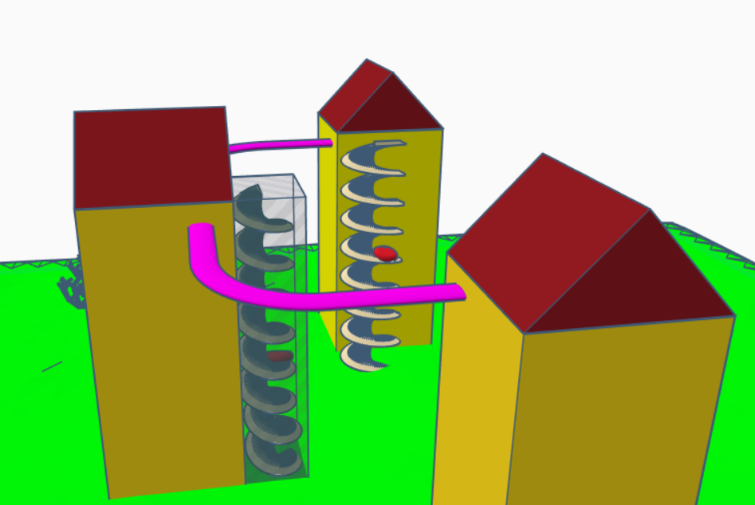

# Akıllı Ürün Teslimat Sistemi

Projenin gerçek versiyonunda apartmanların en üst katında alışveriş merkezlerinin depoları bulunmaktadır. Kullanıcılar mobil uygulamaları üzerinden sipariş verdiğinde ilgili ürünler otomatik olarak dairelerine inmektedir. Projenin daha gelişmiş bir versiyonunda dairelerde her ürünün miktarı sensörlerle kontrol edilmektedir ve minimum sınırın altına inildiğinde sipariş otomatik olarak gerçekleşebilmektedir. Böylece rutin alışverişler için vakit ve enerji harcama tarih olmaktadır.

 

Görüntülemekte olduğunuz dosyalar projenin minyatür ve basit bir versiyonunu yapmak için fikir olması açısından paylaşılmıştır. Bu versiyonun kodları hakkında bilgi için [AÇIKLAMA](AÇIKLAMA.pdf) kısmını okuyunuz.
